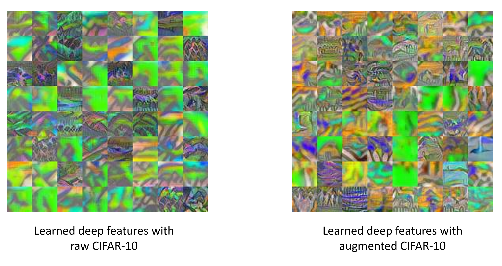

## Code for feature visualization on CIFAR-10

Here we provide the code for feature visualization on CIFAR-10 appeared in Figure 6 of the paper. This experiment aims to demonstrate the existence of feature contamination in real-world datasets such as CIFAR-10. Concretely, we augment the CIFAR-10 training set by padding brick red pixels to the original images and visualize the learned features of a ResNet-32 network trained on it to check if the network has learned the background features, i.e., color features introduced by the padded pixels. 

Following the visualization technique in [Allen-Zhu & Li(2021)](https://arxiv.org/pdf/2005.10190), we preform adversarial training based on the repo [smoothing-adversarial](https://github.com/Hadisalman/smoothing-adversarial/tree/master). The major addition to the repo is

- `code/feature_visualization.py`: the main code to visualize the learned features of the trained network.

### Usage

Sample command for adversarialy training a ResNet-32:

```
python code/train_pgd.py cifar10 cifar_resnet32 model_output_dir_resnet32_250epoch_pad --batch 128 --noise 0.25 --gpu 7 --lr_step_size 50 --epochs 250 --adv-training --attack PGD --num-steps 4 --epsilon 255 --train-multi-noise --num-noise-vec 2 --warmup 10
```

You can also change the `model_output_dir_resnet32_250epoch_pad` to your preferred directory for output models.
By default, the model is trained on our modified CIFAR-10 dataset. To train the model on the original CIFAR-10, comment the line `transforms.Pad(8, (150,50,50)),` in the `_cifar10` function in `code/datasets.py`.

Sample command for visualization:

```
python code/feature_visualization.py
```

You can change the path of pre-trained models in `code/feature_visualization.py`.

### Pre-trained models

We provide models trained on the original CIFAR-10 and our modified CIFAR-10 dataset in [this link](https://drive.google.com/drive/folders/1RCmKMOPFDLbQfA9VESauvf3XziUd8oTE?usp=sharing).


### Example results

Example visualization results are as follows: 



It can be seen that the learned deep features of the neural network trained on our modified CIFAR-10 exhibits significantly different colors, evidencing that background features are learned by the neural network. Due to randomness in feature learning and visualization, visualization results will not be identical across different trials, but similar trends should persist.
